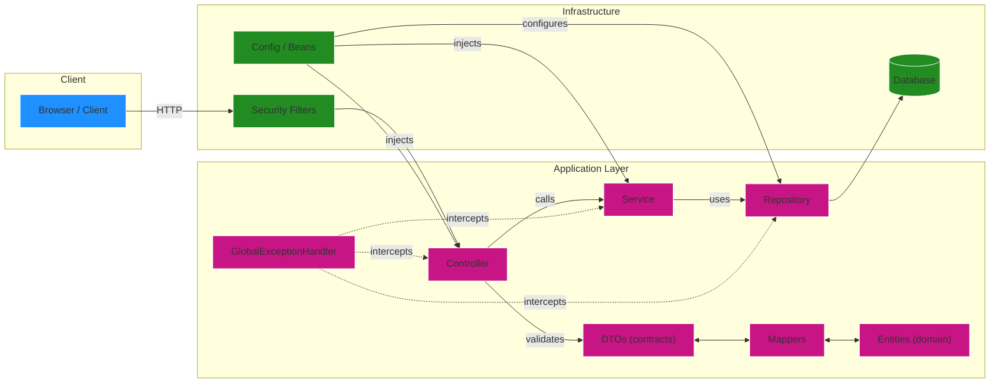

# Sobre
Este projeto é uma **API RESTful** projetada para **gerenciar** colaboradores, agendas e registros diários, oferecendo **operações completas de CRUD** e **processamento interno de dados**. Esta versão da API é voltada para uso em **ambiente de desenvolvimento e testes**, garantindo que as informações sejam **validadas**, **tratadas** e **armazenadas** corretamente no banco de dados.

Se você deseja consultar a **API oficial da AIDA**, utilizada em produção e integrada à plataforma principal, clique [aqui](https://github.com/Shiny-Syntax/aida-apiRESTful-BackEnd).

## Como rodar e testar o projeto na sua máquina(recomendado)
### PRÉ-REQUISITOS
- [**Java 21+**](https://www.oracle.com/java/technologies/downloads/)
- [**Maven 3.9.11+**](https://maven.apache.org/download.cgi)
### PASSO A PASSO
**1.** **Clone o repositório**

Escolha ou crie uma pasta onde você quer guardar o projeto e abra o terminal nela. Depois, execute:
```bash
git clone https://github.com/Shiny-Syntax/aida-apiRESTful.git
```
Isso vai criar uma pasta chamada aida-apiRESTful com todos os arquivos do projeto.

**2.** **Acesse a pasta do projeto**

Entre na pasta do projeto recém-clonada:
```bash
cd aida-apiRESTful
```
**3.** **Instalar dependências**
Se você já tiver o Java e Maven instalados, basta executar:
```
mvn clean install -DskipTests
```
**4. Rodar o projeto**

```
mvn spring-boot:run
```
Isso vai iniciar a API localmente. Por padrão, ela deve ficar disponível em:
```
http://localhost:8080
```
### Instrumentação da API: Documentação e Console de Banco
Para facilitar a validação dos endpoints e a inspeção do banco de dados durante o desenvolvimento, recomendamos acessar:
```
http://localhost:8080/swagger-ui/index.html
```
Como usar a UI do Swagger:

1. Abra a URL do Swagger no navegador.
2. Expanda o controller desejado (Colaborador, Agenda, RegistroDiario).
3. Veja os modelos (request/response), parâmetros e códigos HTTP esperados.
4. Use `Try it out` para enviar requests diretamente e inspecionar respostas.
```
http://localhost:8080/h2-console
```
No H2 Console cole a JDBC URL e conecte para inspecionar tabelas e dados. Atenção: o banco é volátil (dados perdidos ao reiniciar) porque o schema é recriado por `spring.jpa.hibernate.ddl-auto=create`.
## Como rodar e testar o projeto no codespace do github
Recomendamos o uso do Codespace para obter um preview rápido da nossa API RESTful, facilitando testes e validações sem necessidade de configurar o ambiente local.

1. Clique no botão verde <>Code
2. Vá para a aba Codespace e cilque em (+)
3. **Instale o SDKMAN**
```
curl -s "https://get.sdkman.io" | bash
```
Depois **recarregue o shell**:
```
source "$HOME/.sdkman/bin/sdkman-init.sh"
```
Caso já tenha ele instalado, garanta que esteja atualizado:
```
sdk selfupdate force
```
4. **Instalar o Java 21 Oracle ou versões superiores**
```
sdk install java 21.0.9-oracle
```
Caso deseje instalar uma versão superior à 21 ou de outro fornecedor, utilize o comando abaixo para visualizar todas as opções disponíveis e escolher a que melhor atende às suas necessidades:
```
sdk list java
```
5. **Quando o terminal perguntar:**

> “Do you want java 2x.x.x-xxxxxx to be set as default? (y/n)”

- Se **quiser** usar como padrão → digite y

- Se **NÃO** quiser usar como padrão → digite n 
Caso tenha optado por não utilizar como padrão execute:
```
sdk use java 2x.x.x-oracle
```
6. Confirme que tudo está configurado corretamente:
```
mvn -v
```
Você deverá ver algo como:
```
Apache Maven X.X.X
Java version: 2x.x.x

```
7. Instalar dependências do projeto
```
mvn clean install -DskipTests
```
8. Rodar a API da AIDA
```
mvn spring-boot:run

```

## Conheça o projeto

### Tecnologias Utilizadas
- Spring Boot Web
- Spring Boot Data JPA
- Spring Boot Validation
- H2 (runtime, para desenvolvimento/in-memory)
- springdoc-openapi (Swagger UI)


### Funcionalidades Principais 
- **CRUD completo** para todas as entidades da aplicação.
- **Validação de dados** estruturada via DTOs e Bean Validation.
- **Logs detalhados** para depuração e rastreabilidade das operações.
- **Regras de negócio aplicadas** para garantir consistência e integridade dos dados.
- **Pipeline de tratamento e normalização** antes da persistência.
- **Persistência** gerenciada pelo JPA, com mapeamento automático das entidades.
- **Banco H2 configurado** para desenvolvimento, oferecendo isolamento e inspeção rápida via console.
- **Schema gerado e atualizado automaticamente** pelo Hibernate durante o ciclo de desenvolvimento.
- **Retorno de códigos HTTP padronizados** (2xx, 3xx, 4xx, 5xx) com documentação clara e consistente.

## Endpoints principais

Base: `http://localhost:8080`

- **Colaborador** — `/api/colaboradores`
  - `GET /api/colaboradores` — listar
  - `GET /api/colaboradores/{cpf}` — obter por CPF
  - `POST /api/colaboradores` — criar
  - `PUT /api/colaboradores/{cpf}` — atualizar
  - `DELETE /api/colaboradores/{cpf}` — deletar

- **Agenda** — `/api/agenda`
  - `GET /api/agenda` — listar
  - `GET /api/agenda/{id}` — obter por id
  - `POST /api/agenda` — criar (requer `colaboradorCpf`)
  - `PUT /api/agenda/{id}` — atualizar (requer `colaboradorCpf`)
  - `DELETE /api/agenda/{id}` — deletar

- **Registro Diário** — `/api/registros`
  - `GET /api/registros` — listar
  - `GET /api/registros/{id}` — obter por id
  - `POST /api/registros` — criar (requer `colaboradorCpf`)
  - `PUT /api/registros/{id}` — atualizar (requer `colaboradorCpf`)
  - `DELETE /api/registros/{id}` — deletar

---

## Exemplos rápidos

- Criar `Colaborador` (JSON):

```json
{
  "cpf": "55566677788",
  "nome": "Raquel Silva",
  "email": "raquel@example.com",
  "telefone": "+5511991112222",
  "dataNascimento": "1991-05-10",
  "cargo": "Analista",
  "modalidade": "PRESENCIAL",
  "dataAdmissao": "2023-01-15",
  "problemaSaude": "Nenhum",
  "medicamentoUsoDiario": "Nenhum"
}
```

- Criar `Agenda` (JSON):

```json
{
  "tipo": "Reunião",
  "descricao": "Alinhamento semanal",
  "dataHora": "2026-01-01T10:00:00",
  "prioridade": "ALTA",
  "plataforma": "Zoom",
  "status": "AGENDADO",
  "colaboradorCpf": "11122233344"
}
```

- Criar `RegistroDiario` (JSON):

```json
{
  "dataRegistro": "2026-01-01",
  "escalaEmocional": 5,
  "tempoTela": 3,
  "pausasRealizadas": 2,
  "observacoesColaborador": "Tudo certo",
  "observacoesAIDA": "Sem observações",
  "colaboradorCpf": "11122233344"
}
```
---

## Troubleshooting rápido

- Confira a versão do JDK (`java -version`) se a aplicação não iniciar.
- Erros de validação retornam 422 com detalhes — confira o campo e o formato no Swagger.
- Para inspecionar dados: H2 Console em `/h2-console`.



