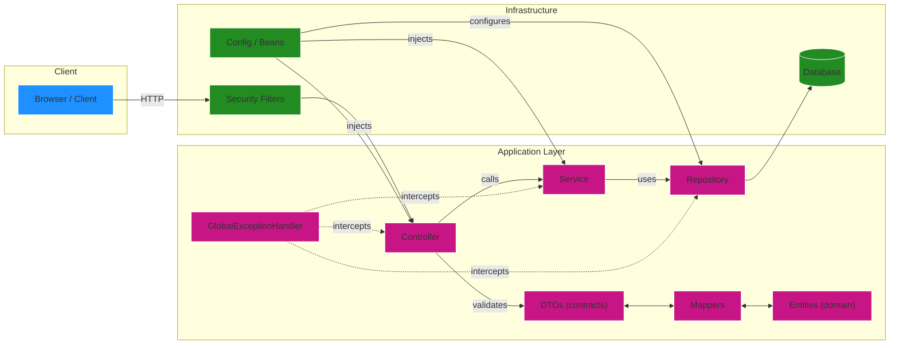

# Sobre
Este projeto é uma **API RESTful** projetada para **gerenciar** colaboradores, agendas e registros diários, oferecendo **operações completas de CRUD** e **processamento interno de dados**. Esta versão da API é voltada para uso em **ambiente de desenvolvimento e testes**, garantindo que as informações sejam **validadas**, **tratadas** e **armazenadas** corretamente no banco de dados.

Se você deseja consultar a **API de Testes**, utilizada em desenvolvimento e integrada à um banco de memória temporária, clique [aqui](https://github.com/Shiny-Syntax/aida-apiRESTful-BackEnd).

## Conheça o projeto

### Tecnologias Utilizadas
- Spring Boot Web
- Spring Boot Data JPA
- Spring Boot Validation
- springdoc-openapi (Swagger UI)

### Funcionalidades Principais

## Endpoints principais

---

---

## Troubleshooting rápido

- Confira a versão do JDK (`java -version`) se a aplicação não iniciar.
- Erros de validação retornam 422 com detalhes — confira o campo e o formato no Swagger.
- Para inspecionar dados: H2 Console em `/h2-console`.

