<br>
<br>

# Sobre
O **PET** (Pessoas, Eventos e Tarefas) é a nossa API RESTful projetada para **gerenciar** colaboradores, agendas e registros diários de forma ágil e organizada. Ele funciona como um ajudante da AIDA, cuidando do **processamento interno dos dados**, garantindo que todas as informações sejam corretamente **validadas, tratadas e armazenadas no banco de dados**.

Com operações completas de CRUD, o PET facilita a gestão de pessoas, o acompanhamento de eventos e o controle das tarefas diárias, oferecendo um ambiente seguro e confiável para desenvolvimento e testes. Pense nele como o pequeno assistente digital da AIDA, sempre pronto para organizar e registrar tudo de forma inteligente e eficiente.

Se você deseja conehcer a **API de Teste**, utilizada para desenvolvimento, clique [aqui](https://github.com/Shiny-Syntax/aida-apiRESTful).

## Conheça o projeto

### [Acesse a API](https://aida-apirestful-backend-production.up.railway.app/)<br>
Para validar e gerenciar os endpoints, bem como monitorar a aplicação em produção, recomendamos utilizar a [documentação Swagger da API](https://aida-apirestful-backend-production.up.railway.app/swagger-ui/index.html), garantindo **segurança, rastreabilidade e facilidade de uso**.<br>


### Tecnologias Utilizadas


- **Spring Boot Web** – desenvolvimento de APIs RESTful.
- **Spring Boot Data JPA** – persistência de dados com mapeamento objeto-relacional.
- **Spring Boot Validation** – validação de dados via Bean Validation.
- **springdoc-openapi (Swagger UI)** – documentação interativa da API.

---
## Funcionalidades Principais

- **CRUD completo** para todas as entidades da aplicação.
- **Validação de dados estruturada** via DTOs e Bean Validation.
- **Logs detalhados** para depuração e rastreabilidade das operações.
- **Regras de negócio aplicadas** para garantir consistência e integridade dos dados.
- **Pipeline de tratamento e normalização** antes da persistência.
- **Persistência gerenciada pelo JPA**, com mapeamento automático das entidades.
- **Schema gerado e atualizado automaticamente** pelo Hibernate durante o ciclo de desenvolvimento.
- **Retorno de códigos HTTP padronizados** (2xx, 3xx, 4xx, 5xx) com documentação clara e consistente.

## Endpoints

- **Colaborador** — `/api/colaboradores`
  - `GET /api/colaboradores` — listar
  - `GET /api/colaboradores/{cpf}` — obter por CPF
  - `POST /api/colaboradores` — criar
  - `PUT /api/colaboradores/{cpf}` — atualizar
  - `DELETE /api/colaboradores/{cpf}` — deletar

- **Agenda** — `/api/agenda`
  - `GET /api/agenda` — listar
  - `GET /api/agenda/{id}` — obter por id
  - `POST /api/agenda` — criar (requer `colaboradorCpf`)
  - `PUT /api/agenda/{id}` — atualizar (requer `colaboradorCpf`)
  - `DELETE /api/agenda/{id}` — deletar

- **Registro Diário** — `/api/registros`
  - `GET /api/registros` — listar
  - `GET /api/registros/{id}` — obter por id
  - `POST /api/registros` — criar (requer `colaboradorCpf`)
  - `PUT /api/registros/{id}` — atualizar (requer `colaboradorCpf`)
  - `DELETE /api/registros/{id}` — deletar

---

## Exemplos rápidos

- Criar `Colaborador` (JSON):

```json
{
  "cpf": "55566677788",
  "nome": "Raquel Silva",
  "email": "raquel@example.com",
  "telefone": "+5511991112222",
  "dataNascimento": "1991-05-10",
  "cargo": "Analista",
  "modalidade": "PRESENCIAL",
  "dataAdmissao": "2023-01-15",
  "problemaSaude": "",
  "medicamentoUsoDiario": ""
}
```

- Criar `Agenda` (JSON):

```json
{
  "tipo": "Reunião",
  "descricao": "Alinhamento semanal",
  "data_conclusao": "2025-11-21",
  "prioridade": "ALTA",
  "plataforma": "Zoom",
  "status": "AGENDADO",
  "colaboradorCpf": "11122233344"
}
```

- Criar `RegistroDiario` (JSON):

```json
{
  "escalaEmocional": 5,
  "tempoTela": 3,
  "pausasRealizadas": 2,
  "observacoesColaborador": "Tudo certo",
  "observacoesAIDA": "Sem observações",
  "colaboradorCpf": "11122233344"
}
```
## Enums do projeto AIDA

### Priority

Representa a prioridade de uma atividade na agenda.

Valores:

- `BAIXA` — label: "BAIXA"
- `MEDIA` — label: "MÉDIA"
- `ALTA` — label: "ALTA"
- `URGENTE` — label: "URGENTE"

Comportamento relevante:

- O método `Priority.fromLabel(String)` aceita tanto o nome do enum (ex.: `ALTA`) quanto o label (ex.: `ALTA` ou `MÉDIA`) e normaliza a entrada. Em caso de valor inválido, lança `BadRequestException`.

Arquivo fonte: `src/main/java/com/shinysyntax/aida/aida/enums/Priority.java`

---

### Modalidade

Representa a modalidade de trabalho do colaborador.

Valores:

- `PRESENCIAL` — label: "PRESENCIAL"
- `HIBRIDO` — label: "HÍBRIDO"
- `REMOTO` — label: "REMOTO"

Comportamento relevante:

- `Modalidade.fromLabel(String)` aceita o nome do enum ou o label e lança `BadRequestException` em caso de entrada inválida.

Arquivo fonte: `src/main/java/com/shinysyntax/aida/aida/enums/Modalidade.java`

---

### AgendaStatus

Representa o status de uma atividade na agenda.

Valores:

- `AGENDADO` — label: "AGENDADO"
- `CANCELADO` — label: "CANCELADO"
- `CONCLUIDO` — label: "CONCLUÍDO"
- `EM_ANDAMENTO` — label: "EM ANDAMENTO"

Comportamento relevante:

- `AgendaStatus.fromLabel(String)` aceita variações do texto (nome do enum, label ou nome com underscore substituído por espaço), normalizando para o enum correspondente. Em caso de valor inválido, lança `BadRequestException`.

Arquivo fonte: `src/main/java/com/shinysyntax/aida/aida/enums/AgendaStatus.java`

---
## Códigos HTTP usados pela API AIDA

### Lista de códigos (resumo)

- `200 OK` — Requisição bem-sucedida e retorno de conteúdo.
- `201 Created` — Recurso criado com sucesso; resposta costuma incluir `Location` e o recurso criado no body.
- `204 No Content` — Operação bem-sucedida sem payload (p.ex. remoção).
- `400 Bad Request` — Dados inválidos na requisição (ex.: campo obrigatório ausente, formato incorreto).
- `404 Not Found` — Recurso buscado não foi encontrado (ex.: colaborador/atividade/registro inexistente).
- `409 Conflict` — Conflito de criação (ex.: tentativa de criar colaborador com CPF já existente).
- `422 Unprocessable Entity` — Erro de validação semântico (Bean Validation falhou: campos inválidos).
- `500 Internal Server Error` — Erro inesperado no servidor.

#### Mapeamento por Controller

#### ColaboradorController (`/api/colaboradores`)

- `GET /api/colaboradores`
  - `200` — Lista retornada com sucesso
  - `500` — Erro interno no servidor

- `GET /api/colaboradores/{cpf}`
  - `200` — Colaborador encontrado
  - `404` — Colaborador não encontrado
  - `500` — Erro interno no servidor

- `POST /api/colaboradores`
  - `201` — Colaborador criado com sucesso
  - `400` — Dados inválidos — algum campo obrigatório está nulo
  - `422` — Validation Error — campos inválidos
  - `409` — Conflito — já existe um registro com este CPF
  - `500` — Erro interno no servidor

- `PUT /api/colaboradores/{cpf}`
  - `200` — Colaborador atualizado com sucesso
  - `400` — Dados inválidos
  - `422` — Validation Error — campos inválidos
  - `404` — Colaborador não encontrado
  - `500` — Erro interno no servidor

- `DELETE /api/colaboradores/{cpf}`
  - `204` — Colaborador removido com sucesso
  - `404` — Colaborador não encontrado
  - `500` — Erro interno no servidor

#### AgendaController (`/api/agenda`)

- `GET /api/agenda`
  - `200` — Lista retornada com sucesso
  - `500` — Erro interno no servidor

- `GET /api/agenda/{id}`
  - `200` — Atividade encontrada
  - `404` — Atividade não encontrada
  - `500` — Erro interno no servidor

- `POST /api/agenda`
  - `201` — Atividade criada com sucesso
  - `400` — Dados inválidos — algum campo obrigatório está nulo
  - `422` — Erro de validação — dados do request inválidos
  - `404` — Colaborador não encontrado
  - `500` — Erro interno no servidor

- `PUT /api/agenda/{id}`
  - `200` — Atividade atualizada com sucesso
  - `400` — Dados inválidos
  - `422` — Erro de validação — dados do request inválidos
  - `404` — Colaborador ou atividade não encontrado
  - `500` — Erro interno no servidor

- `DELETE /api/agenda/{id}`
  - `204` — Atividade removida com sucesso
  - `404` — Atividade não encontrada
  - `500` — Erro interno no servidor

#### RegistroDiarioController (`/api/registros`)

- `GET /api/registros`
  - `200` — Lista retornada com sucesso
  - `500` — Erro interno no servidor

- `GET /api/registros/{id}`
  - `200` — Registro encontrado
  - `404` — Registro não encontrado
  - `500` — Erro interno no servidor

- `POST /api/registros`
  - `201` — Registro criado com sucesso
  - `400` — Dados inválidos — algum campo obrigatório está nulo
  - `422` — Erro de validação — dados do request inválidos
  - `404` — Colaborador não encontrado
  - `500` — Erro interno no servidor

- `PUT /api/registros/{id}`
  - `200` — Registro atualizado com sucesso
  - `400` — Dados inválidos
  - `422` — Erro de validação — dados do request inválidos
  - `404` — Colaborador ou registro não encontrado
  - `500` — Erro interno no servidor

- `DELETE /api/registros/{id}`
  - `204` — Registro removido com sucesso
  - `404` — Registro não encontrado
  - `500` — Erro interno no servidor

### Observações e práticas recomendadas

- `400` vs `422`: no projeto usamos `400` para erros estruturais (por exemplo, falta de campo obrigatório) e `422` para falhas de validação semântica (Bean Validation). Isso aparece explicitamente nas anotações de `@ApiResponse`.
- `201` responses para criação incluem `Location` apontando para o recurso criado.
- `204` é usado para deletar recursos com resposta vazia.
- Erros inesperados resultam em `500` — ver `GlobalExceptionHandler` para tratamento (se presente no projeto).


## Estrutura

```mermaid
graph LR
  %% ===== CLIENT =====
  %% ===== CLIENT & TOOLS =====
  subgraph Client["Client & Tools"]
    direction TB
    A["Browser / API Client"]
    SW["Swagger UI / OpenAPI"]
  end

  %% ===== DEPLOY & INFRA =====
  subgraph Platform["Railway Platform (hosting)"]
    direction TB
    App["AIDA Spring Boot App\n(Railway App / Container)"]
    PG[("PostgreSQL (Railway)")]
    Secrets["Environment & Secrets (RAILWAY_POSTGRES_URL)"]
  end

  %% ===== CI/CD =====
  subgraph CI["CI/CD"]
    GH["GitHub (repo)"]
    Actions["GitHub Actions / CI pipeline"]
  end

  %% ===== APPLICATION LAYERS =====
  subgraph AppLayer["Application Layer"]
    direction TB
    C["Controllers (REST)"]
    D["DTOs (requests/responses)"]
    M["Mappers"]
    S["Services (business)"]
    R["Repositories (Spring Data JPA)"]
    E["Entities (JPA)"]
    EX["GlobalExceptionHandler"]
  end

  %% ===== RELATIONSHIPS =====
  A -->|HTTP| SW
  SW -->|HTTP| App
  A -->|HTTP| App
  App -->|JDBC| PG
  App -->|reads| Secrets
  GH --> Actions -->|deploy| App

  App --> C
  C -->|validates| D
  C -->|calls| S
  D <--> M
  M <--> E
  S -->|uses| R
  R -->|persists| E
  R --> PG
  EX -.->|intercepts| C
  EX -.->|intercepts| S

  %% ===== STYLES =====
  classDef client fill:#1E90FF,stroke:#ffffff,stroke-width:1px;
  classDef platform fill:#663399,stroke:#ffffff,stroke-width:1px;
  classDef ci fill:#24292f,stroke:#ffffff,stroke-width:1px;
  classDef app fill:#C71585,stroke:#ffffff,stroke-width:1px;

  class A,SW client;
  class App,PG,Secrets platform;
  class GH,Actions ci;
  class C,D,M,S,R,E,EX app;
```



---

## Organização de pastas
```
aida-apiRESTful-BackEnd/
├── .github/
├── scripts/
├── src/
│   ├── main/
│   │   ├── java/
│   │   │   └── com/shinysyntax/aida/aida/
│   │   │       ├── AidaApplication.java
│   │   │       ├── config/
│   │   │       ├── controller/
│   │   │       ├── converter/
│   │   │       ├── dto/
│   │   │       ├── entity/
│   │   │       ├── enums/
│   │   │       ├── exception/
│   │   │       ├── mapper/
│   │   │       ├── repository/
│   │   │       ├── security/
│   │   │       └── service/
│   │   └── resources/
│   │       ├── application.properties
│   │       └── db/
│   │           └── migration/
│   │               └── V1_create_tables.sql
│   └── test/
│       ├── java/
│       └── resources/
├── target/
├── pom.xml
├── mvnw
├── mvnw.cmd
└── README.md
```


