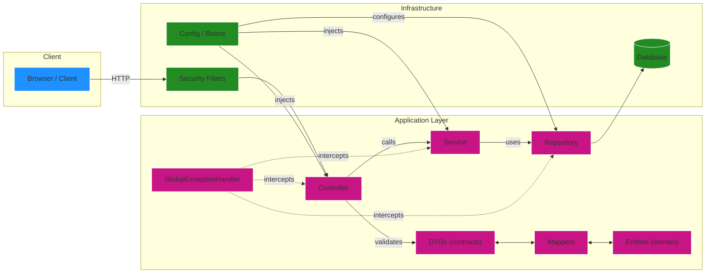

# AIDA — API RESTful

Repositório da API RESTful AIDA para gerenciar colaboradores, agenda e registros diários.

Resumo rápido
- Endpoints CRUD para `Colaborador`, `Agenda` e `RegistroDiario`.
- Validação de entrada via DTOs e Bean Validation (Jakarta Validation).
- Persistência via Spring Data JPA; testes usam H2 em memória.

Importante sobre datas
- `dataHora` (campo em `Agenda`) é gerado e controlado pelo servidor — o cliente NÃO deve enviar esse campo.
- `data_conclusao` (campo em `Agenda`) é OBRIGATÓRIO no `POST/PUT /api/agenda` e deve ser enviado no formato `yyyy-MM-dd`.

## Pré-requisitos
- Java 21
- Maven (opcional — use o wrapper incluído)

## Build / Run / Test (Windows)

Build:
```cmd
mvnw.cmd clean package -DskipTests
```

Executar (desenvolvimento):
```cmd
mvnw.cmd spring-boot:run
```

Executar o JAR:
```cmd
java -jar target\aida-0.0.1-SNAPSHOT.jar
```

Testes:
```cmd
mvnw.cmd test
```

## Documentação da API
- Swagger UI: `http://localhost:8080/swagger-ui/index.html`
- OpenAPI JSON: `http://localhost:8080/v3/api-docs`

## Endpoints principais

Base: `http://localhost:8080`

- **Colaborador** — `/api/colaboradores`
  - `GET /api/colaboradores`
  - `GET /api/colaboradores/{cpf}`
  - `POST /api/colaboradores`
  - `PUT /api/colaboradores/{cpf}`
  - `DELETE /api/colaboradores/{cpf}`

- **Agenda** — `/api/agenda`
  - `GET /api/agenda`
  - `GET /api/agenda/{id}`
  - `POST /api/agenda` — criar (requer `colaboradorCpf` e `data_conclusao`)
  - `PUT /api/agenda/{id}` — atualizar (requer `colaboradorCpf` e `data_conclusao`)
  - `DELETE /api/agenda/{id}`

- **Registro Diário** — `/api/registros`
  - `GET /api/registros`
  - `GET /api/registros/{id}`
  - `POST /api/registros` — criar (campo `dataRegistro` é opcional; se ausente, o servidor registra a data atual)
  - `PUT /api/registros/{id}`
  - `DELETE /api/registros/{id}`

## Exemplos rápidos

Criar `Colaborador` (JSON):

```json
{
  "cpf": "55566677788",
  "nome": "Raquel Silva",
  "email": "raquel@example.com",
  "telefone": "+5511991112222",
  "dataNascimento": "1991-05-10",
  "cargo": "Analista",
  "modalidade": "PRESENCIAL",
  "dataAdmissao": "2023-01-15",
  "problemaSaude": "Nenhum",
  "medicamentoUsoDiario": "Nenhum"
}
```

Criar `Agenda` (JSON) — `data_conclusao` obrigatório; não envie `dataHora`:

```json
{
  "tipo": "Reunião",
  "descricao": "Alinhamento semanal",
  "data_conclusao": "2026-01-01",
  "prioridade": "ALTA",
  "plataforma": "Zoom",
  "status": "AGENDADO",
  "colaboradorCpf": "11122233344"
}
```

Criar `RegistroDiario` (JSON):

```json
{
  "dataRegistro": "2026-01-01",
  "escalaEmocional": 5,
  "tempoTela": 3,
  "pausasRealizadas": 2,
  "observacoesColaborador": "Tudo certo",
  "observacoesAIDA": "Sem observações",
  "colaboradorCpf": "11122233344"
}
```

## Banco de Dados (observações)
- Em testes a aplicação usa H2 em memória; em produção use PostgreSQL.
- Certifique-se de que as sequências `seq_id_atividade` e `seq_id_registro` existem em produção.
- A coluna `data_conclusao` deve existir em `agenda` — a aplicação mapeia essa coluna.
- Campos de texto longos foram mapeados como `TEXT` (não OID/LOB) para facilitar backup e consultas.

## DDL sugerido (PostgreSQL)

```sql
CREATE SEQUENCE IF NOT EXISTS seq_id_atividade START 1 INCREMENT 1;
CREATE SEQUENCE IF NOT EXISTS seq_id_registro START 1 INCREMENT 1;

CREATE TABLE IF NOT EXISTS colaborador (
  cpf_colaborador BIGINT PRIMARY KEY,
  nome VARCHAR(255) NOT NULL,
  email VARCHAR(255),
  telefone VARCHAR(255),
  data_nascimento DATE,
  cargo VARCHAR(255),
  modalidade VARCHAR(20),
  data_admissao DATE,
  problema_saude TEXT NOT NULL DEFAULT 'NÃO POSSUI PROBLEMAS DE SAÚDE',
  medicamento_uso_diario TEXT NOT NULL DEFAULT 'NÃO FAZ USO DE MEDICAMENTO CONTROLADO'
);

CREATE TABLE IF NOT EXISTS agenda (
  id_atividade BIGINT PRIMARY KEY DEFAULT nextval('seq_id_atividade'),
  tipo VARCHAR(255),
  descricao TEXT,
  data_hora TIMESTAMP,
  data_conclusao DATE,
  prioridade VARCHAR(20),
  plataforma VARCHAR(255),
  status VARCHAR(20),
  cpf_colaborador BIGINT,
  CONSTRAINT fk_agenda_colaborador FOREIGN KEY (cpf_colaborador) REFERENCES colaborador(cpf_colaborador)
);

CREATE TABLE IF NOT EXISTS registro_diario (
  id_registro BIGINT PRIMARY KEY DEFAULT nextval('seq_id_registro'),
  data_registro DATE,
  escala_emocional DOUBLE PRECISION,
  pausas_realizadas INTEGER,
  tempo_tela INTEGER,
  cpf_colaborador BIGINT,
  observacoes_colaborador VARCHAR(400),
  observacoesaida TEXT,
  CONSTRAINT fk_registro_colaborador FOREIGN KEY (cpf_colaborador) REFERENCES colaborador(cpf_colaborador)
);
```

## Próximos passos sugeridos
- Se quiser que eu gere uma migration Flyway com esse DDL, eu posso criar `src/main/resources/db/migration/V1__create_schema.sql`.
- Posso também adicionar validações adicionais para `data_conclusao` (por exemplo: não permitir datas no passado) e documentar isso no OpenAPI.

Se quiser que eu aplique a migration Flyway agora ou adicione validação, diga qual opção prefere.
# Sobre
Este projeto é uma **API RESTful** projetada para **gerenciar** colaboradores, agendas e registros diários, oferecendo **operações completas de CRUD** e **processamento interno de dados**. Esta versão da API é voltada para uso em **ambiente de desenvolvimento e testes**, garantindo que as informações sejam **validadas**, **tratadas** e **armazenadas** corretamente no banco de dados.

Se você deseja consultar a **API de Testes**, utilizada em desenvolvimento e integrada à um banco de memória temporária, clique [aqui](https://github.com/Shiny-Syntax/aida-apiRESTful-BackEnd).


## Conheça o projeto

### Tecnologias Utilizadas
- Spring Boot Web
- Spring Boot Data JPA
- Spring Boot Validation
- springdoc-openapi (Swagger UI)


### Funcionalidades Principais


## Endpoints principais


---

---

## Troubleshooting rápido

- Confira a versão do JDK (`java -version`) se a aplicação não iniciar.
- Erros de validação retornam 422 com detalhes — confira o campo e o formato no Swagger.
- Para inspecionar dados: H2 Console em `/h2-console`.


